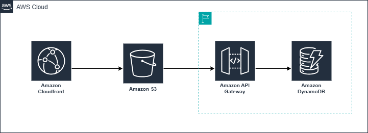
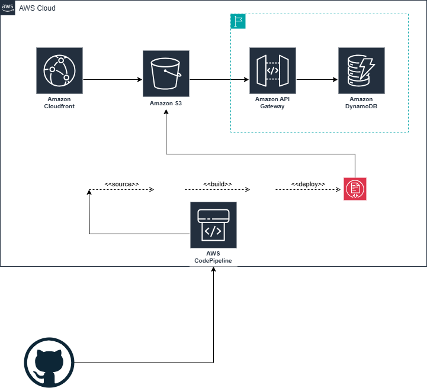

# 📝 Projeto Angular - Blog Técnico

Este projeto é uma aplicação Angular para publicação de posts técnicos, com estrutura modular e consumo de API para exibição de artigos.

---

## 📦 Estrutura do Projeto

- **AppModule**: Módulo principal que declara todos os componentes da aplicação.
- **Componentes**:
  - `AppComponent`: Componente raiz.
  - `NavHeaderComponent`: Cabeçalho de navegação com barra de busca.
  - `SidebarComponent`: Lista de tópicos e artigos.
  - `BodyComponent`: Corpo principal com lógica de carregamento de artigos.
  - `BlogpostComponent`: Exibição de conteúdo de um artigo.
  - `FooterComponent`: Rodapé da aplicação.
  - `HelloComponent`: Exemplo simples de uso de input.

---

## 🛠️ Arquitetura implementada na nuvem AWS
  - **Serviços base**
    - Amazon CloudFront: Distribui o conteúdo da aplicação com baixa latência global.
    - Amazon S3: Armazena os arquivos estáticos da aplicação (HTML, CSS, JS).
    - Amazon API Gateway: Expõe os endpoints da API que interagem com o backend.
    - Amazon Dynamodb: Banco de dados NoSQL para persistência de dados.
 

---

## 🧩 Serviços

- **BaseService**
  - Responsável por armazenar a base da URL e injetar o `HttpClient`.
  - Variáveis:
    - `urlapi`: `"https://myapigateway.execute-api.us-east-1.amazonaws.com"`
    - `httpBase`: Cliente HTTP usado por outros serviços.

- **ArticleService**
  - Usa o `BaseService` para acessar endpoints de artigos.
  - Métodos:
    - `getAllArticles()`: Retorna todos os artigos disponíveis.
    - `getArticle(articleId)`: Retorna um artigo específico com base no `articleId`.

---

## 📚 Modelo de Dados

### `ModelArticles`
Representa um artigo técnico.

| Propriedade       | Tipo     | Descrição                      |
|-------------------|----------|--------------------------------|
| `articleId`       | number   | ID do artigo                   |
| `title`           | string   | Título do artigo               |
| `date_of_included`| string   | Data de inclusão               |
| `introduction`    | string   | Introdução/resumo do conteúdo  |
| `content`         | string   | Conteúdo completo em HTML      |

---

## ⚙️ Como executar o projeto
```bash
npm install
ng serve
```
Comandos que podem ser úteis

```bash
npm install --save-dev @angular/cli@12.2.14

tsconfig: "enableIvy": false,
```
---

## 🚀 CI/CD com AWS
A aplicação do PersonBlog é uma aplicação web estática com backend serverless, hospedada na AWS, e implementa um pipeline de integração e entrega contínua (CI/CD) com os seguintes componentes:

### Arquitetura

  - **Componentes AWS Utilizados**

    - AWS CodePipeline: Orquestra o fluxo de CI/CD desde o repositório até o deploy.

    - GitHub: Sistema de versionamento e repositório de código-fonte.

### Fluxo do Pipeline

  - **Source**

    - Nesta etapa que realizo o conexão do código que está versionado no Github com o processo de Pipeline. A conexão é feita através do Amazon CodeStar. *(O AWS CodeStar é um serviço da Amazon Web Services que fornece uma interface unificada para gerenciar o desenvolvimento de aplicações na AWS, permitindo que você configure rapidamente um pipeline de CI/CD completo e um ambiente de desenvolvimento colaborativo.)*

    - Cada push no repositório aciona o AWS CodePipeline.

- **Build**

  - Nesta etapa de build pode o código obtido no passo anterior é submetido ao build com AWS CodeBuild.

  - O resultado é um arquivo zip para ser empacotado e enviado ao destino (S3/API).

- **Deploy**

  - Por fim o arquivo empacotado no processo anterior e enviado para o Action Provider Amazon S3, sendo necessário informar apenas o nome do Bucket.
  *Necessário marcar a opção de `Extract file before deploy` pois o processo de build vai gerar um arquivo compactado.*

   